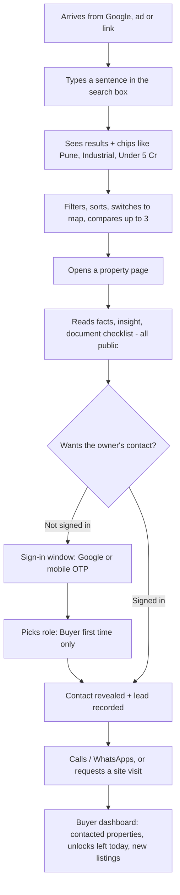
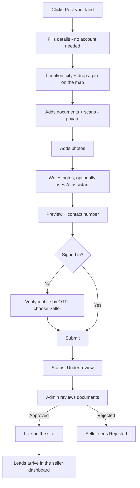
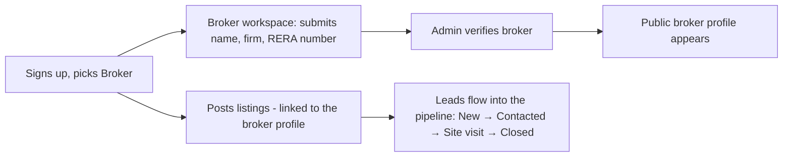

# 03 · User Journeys

A "journey" is the path a person takes to reach their goal. This document shows each one step by step, then how the pieces connect. Diagrams use a simple text format called Mermaid (GitHub and most Markdown viewers draw them automatically).

---

## 1. Buyer journey

**Goal:** find a suitable, trustworthy plot and reach the owner.

**Step details**

| Step | What the buyer sees | What happens behind the scenes |
|---|---|---|
| Search | Chips appear for each understood filter; each chip can be removed | The sentence is sent to the server; AI (if configured) or rules convert it to filters. Rate-limited per visitor. |
| Results | Cards with photo, price, area, city, match % (only when needs were stated), masked contact | Match % = weighted score of city, category, type, budget, size against the filters. |
| Property page | Photos, key facts, "Executive appraisal", connectivity, document checklist, similar listings | Page is rendered on the server (good for Google). Owner phone is **not** in the page data. |
| Unlock | Button "Unlock contact details" | Server checks: signed in? listing live? under 20 unlocks today? Then logs a lead and returns the number. |
| Enquiry | Form: message, preferred date and slot | Saved as an enquiry; limit 10/day; the owner sees it in their lead list. |

**Edge cases handled:** not signed in → sign-in window opens (no dead end); daily limit reached → clear message; listing removed → 404 page; storage blocked in browser → site still works.

---

## 2. Seller journey (individual owner)

**Goal:** list land, get reviewed, receive leads.

Why the form comes **before** login: people abandon long sign-ups. Asking for the OTP only at the end keeps them filling in the form, and the OTP itself creates their account.

**What the seller controls:** their facts, photos, documents and contact number. **What they cannot do:** publish themselves or mark anything verified.

---

## 3. Broker journey

Unverified brokers can list, but their public profile and "Verified broker" badge stay hidden until an admin approves.

---

## 4. Admin journey (operations)

1. Open **Approval queue** → filter "pending".
2. For each listing: read the details, open each **private document** (link works for 10 minutes), type the reference number, click **Verify** or **Reject**.
3. Click **Publish** (goes live) or **Reject**. The Verified badge appears automatically only if every document is verified.
4. **Users & brokers:** change a role, verify a broker after checking RERA/agency proof.
5. **Analytics:** watch listings, views, unlocks and enquiries.

## 5. Super admin journey (site owner)

| Task | Where | Result |
|---|---|---|
| Change brand colours, add a gradient, change fonts, line height, spacing | Admin → Theme & design | Whole site updates on Save |
| Edit any headline, paragraph or button text on Home/Header/Footer | Admin → Content | Live within about a minute |
| Hide or show a section (e.g., testimonials) | Admin → Content → Sections | Section disappears/appears |
| Improve a page's Google title, description, intro text, FAQs | Admin → SEO | Page metadata and structured data change |
| Publish an article | Admin → Blog | Appears at `/blog`, in the sitemap and on Home |
| Move an old link to a new page | Admin → Redirects | Visitors are forwarded (301) |

Step-by-step instructions: [Admin manual](17-admin-manual.md).

---

## 6. Workspaces open in separate tabs

The header's **"Desk ↗"** button opens the person's workspace in a new browser tab. Each workspace has its own top bar (no marketplace header) so someone can keep the marketplace open in one tab and work in the other:

- **Buyer workspace:** unlocks left today, contacted properties, saved listings, new verified listings.
- **Seller workspace:** listings and status, views, leads with status control.
- **Broker workspace:** profile/verification, listings, conversion rate, lead pipeline.
- **Admin workspace:** approval queue, users, analytics, theme, content, SEO, blog, redirects.

Roles are enforced on the server: a buyer who types a seller URL is redirected to their own workspace.

---

## 7. Sign-in states (all the ways in)

| Method | Who | Notes |
|---|---|---|
| Google | Anyone | New users are asked which role they need |
| Mobile OTP (+91) | Anyone | Needed for sellers so buyers can be given a real number |
| Email + password | Admins | Under "Sign in with email" |
| Demo login | Developers only | Exists only when no database is connected and never in production |
