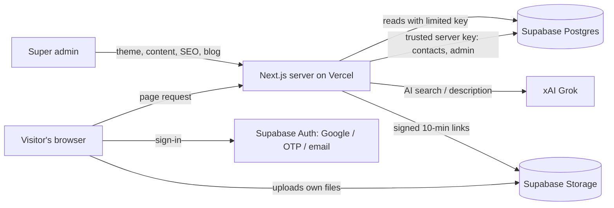
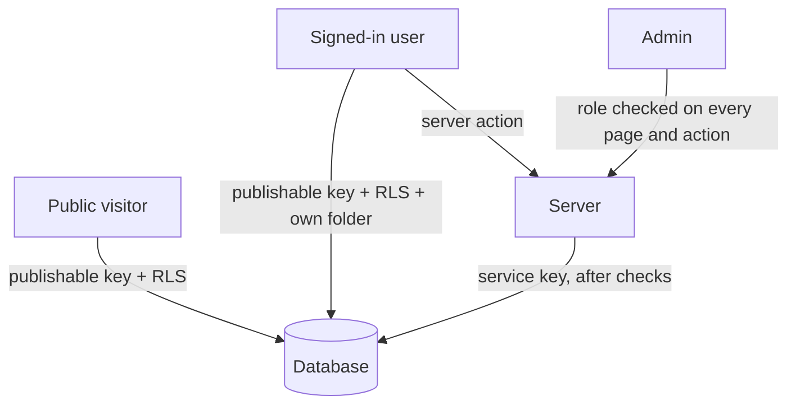

# 06 · System Architecture

## 1. The big picture (non-technical)

Think of PLOTSS as a shop:

- **The shop window** = the pages visitors see (fast, pretty, readable by Google).
- **The back office** = the server code that checks who you are and decides what you may see or do.
- **The vault** = the database and file storage. Nobody reaches the vault directly except through strict rules.
- **The manager's desk** = the admin area, where the owner changes the look, words and settings.



## 2. Layers

| Layer | Folder | Responsibility |
|---|---|---|
| Pages & routing | `src/app` | Decides which page/URL shows what; runs on the server |
| Marketplace UI | `src/ui` | The visual screens (home, search, property, post) as React components |
| Business logic | `src/lib` | Database reads/writes, SEO, AI, rate limits, masking, sessions |
| Database rules | `supabase/migrations` | Tables, security policies, triggers |

## 3. How a page request flows

Example: a visitor opens a property page.

1. Request arrives; a small **proxy** checks the redirects table (e.g., old URL → new URL).
2. The **layout** loads: current user (from the login cookie), site data (listings, cities, blog cards), editable content.
3. The **property page** loads the listing from the database. The result has **masked** owner details only.
4. Page metadata (title, description, canonical, social image) and structured data are built from the listing and any admin override.
5. HTML is sent to the browser; React "wakes up" (hydrates) and the page becomes interactive.
6. When the visitor clicks **Unlock**, the browser calls a **server action**. The server checks login + limits, records the lead, and returns the real contact for that one listing.

## 4. Rendering and caching

| Data | Where cached | How long | Refreshed when |
|---|---|---|---|
| Theme | Server cache tag `theme` | until changed | Admin saves theme |
| Content (texts, hidden sections) | Tag `content` | 5 min | Admin saves content |
| Site data (listings, cities, blog cards, stats) | Tag `site-data` | 2 min | Admin approves/changes listings or content |
| SEO settings and rows | Tag `seo` | 5 min | Admin saves SEO |
| Redirects | In-memory | 60 s | Automatic |
| Database-ready check | In-memory | 30 s | Automatic |

## 5. Theme system

1. Admin edits colours/fonts/spacing → saved as one JSON row (`site_settings.key = 'theme'`).
2. On every page, the server turns it into CSS variables inside a `<style>` tag in the page head.
3. Tailwind utilities and the components read those variables (e.g., `bg-clay` uses `--c-clay`; `paint-clay` uses `--f-clay`, which may be a gradient).
4. Inputs are **validated**: colours must be valid hex, fonts must be from an approved list, numbers are clamped. This prevents anyone injecting harmful CSS.

## 6. Content system (WordPress-style editing)

- In the code, editable text is written as `<T k="home.hero.title">Default text</T>`.
- A script scans the code and creates the list of all editable keys (currently 84) for the admin **Content** screen.
- An admin override is stored in `site_settings.key = 'content'`. If there is no override, the default text in the code shows.
- Sections can be wrapped in `<Show k="…">` to be switched on/off. Testimonials and regulatory badges start hidden.

## 7. Security architecture in one picture



- The **publishable key** can only do what RLS allows (e.g., read live listings).
- The **service key** lives only on the server and is used *after* the server has verified the user and limits.
- Owner contacts sit in a table that RLS locks completely; only the server can read it.

Full detail: [Security & privacy](08-security-and-privacy.md).

## 8. Project structure (developer map)

```
src/
  app/
    layout.tsx                 root: fonts, theme CSS, SEO defaults
    (site)/                    public marketplace (has header/footer/sign-in)
      page.tsx                 home
      search/  property/[slug]/  city/[slug]/  category/[slug]/  broker/[id]/
      blog/  post-property/
      actions.ts               unlock contact, enquiry, view counter
      ai-actions.ts            AI search + description
    (app)/dashboard/…          buyer, seller, broker workspaces (own layout)
    admin/                     admin workspace (listings, users, analytics, theme, content, seo, blog, redirects)
    sitemap.ts robots.ts llms.txt/
  proxy.ts                     applies redirects
  ui/                          screens, components, providers, dashboards
  lib/
    db/                        listings, contacts, dashboards, admin, blog
    seo.ts  content/  theme/  ai/  markdown.tsx  rate-limit.ts  session.ts  auth.ts
supabase/migrations/           0001_init.sql, 0002_listings_cms_seo.sql
scripts/                       seed-db.ts, gen-content-registry.mjs, image helpers
tests/                         unit tests
```

## 9. Key design decisions (short form)

Full reasoning is in [Risks & decision log](16-risks-and-decisions.md). Summary:

- **Server-rendered pages** for SEO instead of a single-page app.
- **Security in the database** (RLS + triggers) so a mistake in app code cannot expose data.
- **Runtime-editable theme/content** instead of hard-coded design.
- **Graceful fallback** to demo data so development never blocks on the database.
- **One provider-agnostic AI client** so the AI vendor can change without touching features.

## 10. Scaling path

| Stage | Listings | Change needed |
|---|---|---|
| Now | up to ~300 | None |
| Next | 300 to 3,000 | Move search/filtering and pagination to the server (SQL filters), add database indexes for filters, image CDN |
| Later | 3,000+ | Search engine (e.g., Postgres full-text or Typesense), background jobs for alerts, Redis for rate limits, read replicas |
