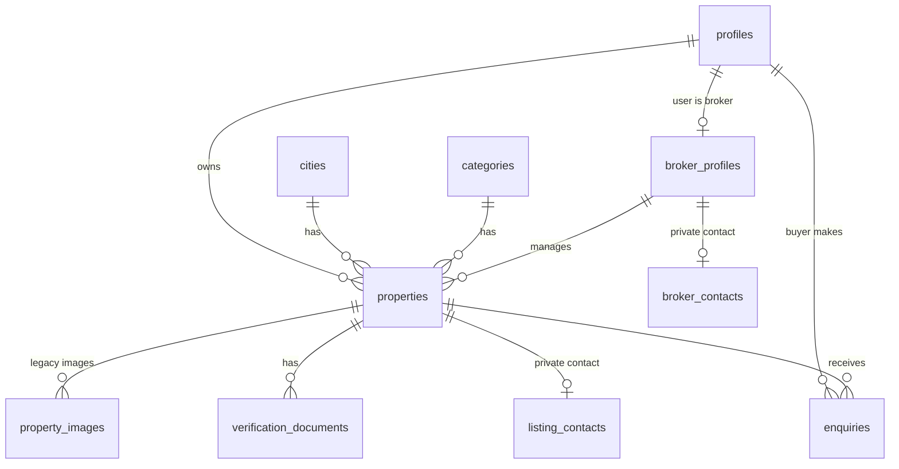

# 07 · Database & Data Dictionary

The database is **PostgreSQL** hosted by Supabase. It is created by two SQL files run once in the Supabase SQL Editor:

1. `supabase/migrations/0001_init.sql`: base tables and security.
2. `supabase/migrations/0002_listings_cms_seo.sql`: rich listings, private contacts, brokers, CMS/SEO/blog/redirects, file storage, and stronger security. **Run this before launch.**
3. `supabase/migrations/0003_launch_cities_and_analytics.sql`: launch cities with an `active` switch, and the `events` table for journey analytics. **Run after 0002.**

## 1. Relationships (ERD)



## 2. Tables in plain English

| Table | What it holds | Who can read it | Who can change it |
|---|---|---|---|
| `profiles` | One row per user: name, phone, role (buyer/seller/broker/admin) | The user themself and admins | The user (but never their own role beyond buyer → seller/broker); admins |
| `cities` | Cities (name, state, slug) with `active` and `sort_order`; only active ones are offered | Everyone | Admins |
| `categories` | Industrial, Commercial, Residential, Warehousing | Everyone | Admins |
| `properties` | The listings | Everyone sees **live** ones; owners see their own; admins see all | Owners edit their own but **cannot** publish or verify; admins can |
| `listing_contacts` | **Private** owner name, phone, type per listing | Nobody through the public API (server only) | Server / admins |
| `verification_documents` | Each document of a listing: name, status, reference, file path | Owner and admins | Owner can add (always "pending"); only admins can verify |
| `enquiries` | Two kinds: **unlock** (contact revealed) and **enquiry** (message/visit request); also lead status | The buyer, the listing owner, admins | Buyer creates; owner updates lead status (through the server) |
| `saved_listings` | Reserved for account-level saved listings | Owner of the row | Owner |
| `broker_profiles` | Broker name, firm, RERA number, cities, verified flag | Public if verified; the broker; admins | Broker edits (cannot self-verify); admins |
| `broker_contacts` | **Private** broker phone/email | Admins / server | Admins / server |
| `site_settings` | Key/value JSON: `theme`, `content`, `seo_global`, `features` (launch switches) | Everyone (values are public by design) | Admins |
| `seo_pages` | Per-page SEO override (title, description, heading, intro, FAQs, canonical, noindex) and the listing template | Everyone | Admins |
| `blog_posts` | Articles (Markdown), status draft/published | Published: everyone; drafts: admins | Admins |
| `redirects` | Old path → new path (301/302) | Everyone (needed by the proxy) | Admins |
| `events` | One row per tracked action: visitor id, session id, user id (server-filled), type, path, label, small props, referrer, UTM, device, country/city | Nobody through the public API; admins and the server | Server only (via `/api/track` and server actions); purged after 13 months |
| `property_images` | Older image table from the first design; photos now live in `properties.hero_image` + `gallery` | as listing | as listing |

## 3. Important columns

### `properties`

| Column | Meaning |
|---|---|
| `title`, `slug` | Headline and URL piece (`/property/<slug>`); slug is unique |
| `listing_type` | `sale`, `lease` or `rent` |
| `category_id`, `city_id` | Links to categories and cities |
| `micro_market`, `address`, `lat`, `lng` | Area name and map pin |
| `price` | Rupees (whole number). Shown as ₹ Cr / Lakh |
| `area_value`, `area_unit` | Size and unit (`acre`, `sqft`, `sqm`) |
| `zone_type` | e.g., "Industrial (Light/Engineering)" |
| `status` | `draft`, `pending`, `live`, `sold`, `rejected` |
| `is_verified` | Computed from documents; only admins/server can set |
| `hero_image`, `gallery` | Cover photo and other photo URLs |
| `broker_id` | The broker managing it (optional) |
| `views` | Page views (counted once per browser session) |
| `details` (JSON) | Includes `ai_screen` (risk score, flags, summary, time) written by the AI risk screen. Extra rich fields: connectivity, price history, road/power/water text, match notes, display strings. `details.demo = true` marks demo data |

### `enquiries`

`kind` = `unlock` or `enquiry`; `status` = lead stage (`open` → `contacted` → `visit` → `closed`); `visit_date`; `message`; `buyer_id`; `property_id`; `created_at`. Unlock rows power the daily limit.

### `verification_documents`

`doc_type` (name), `category`, `status` (`pending`, `verified`, `rejected`, `action_required`), `doc_ref` (reference number), `verified_on`, `file_url` (private storage path), `description`.

## 4. Security rules in the database (summary)

- **RLS is on for every table.** With no matching rule, access is denied.
- `is_admin()` is a small function used inside the rules.
- **Trigger `prevent_role_escalation`:** users cannot make themselves admin; a normal user may only go buyer → seller/broker once. Trusted server/SQL contexts are allowed (that is how the first admin is created).
- **Trigger `guard_property_moderation`:** on insert, non-admins are forced to `pending/draft` and `is_verified=false`; on update they cannot change `is_verified`, `views`, `broker_id`, or set status `live`/`rejected`.
- **Trigger `guard_document_status`:** non-admins cannot mark documents verified or set references.
- **Trigger `guard_broker_verified`:** brokers cannot verify themselves.
- **Function `increment_views`:** the only way to add views, callable by the server only.
- **Storage policies:** anyone may read the public photo bucket; users may write only into a folder named after their own user id; the private document bucket is readable only by the owner and admins.

## 5. Storage buckets

| Bucket | Public? | Limits | Contents |
|---|---|---|---|
| `listing-photos` | Yes (read) | 5 MB; JPG/PNG/WebP | Listing photos |
| `listing-docs` | **No** | 10 MB; PDF/JPG/PNG | Ownership and approval documents |

Admins open private documents through **signed links that expire in 10 minutes**.

## 6. Seeding demo data

`npx tsx --env-file=.env scripts/seed-db.ts` adds 10 demo listings, 2 demo brokers, SEO copy and 3 articles (idempotent: running twice does not duplicate). Demo listings are tagged `details.demo = true`. To remove them:

```sql
delete from properties where details->>'demo' = 'true';
```

Demo brokers can be removed from `broker_profiles` in the Supabase table editor.

## 7. Data retention and backups (recommended policy)

| Data | Keep | Note |
|---|---|---|
| Live listings | While live + 1 year after sold/removed | For dispute handling |
| Private documents | While listing exists + 1 year | Delete on owner request unless legally required |
| Enquiries/unlocks | 2 years | Needed for lead history and abuse checks |
| Accounts | Until deletion request | Provide a way to request deletion |
| Backups | Supabase daily backups (plan-dependent); enable Point-in-Time Recovery for production | Test a restore once |
