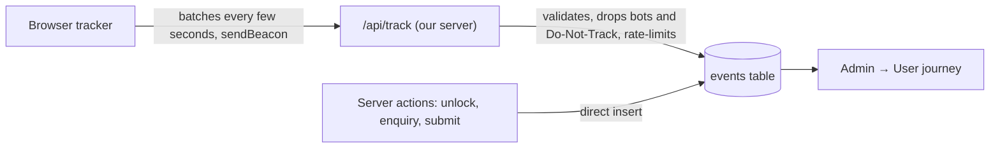

# 21 · Analytics & User Journey Tracking

**The question this answers:** *"Which page did people visit, which button did they click how many times, who started the form and where did they give up: how far can we track a user's journey?"*

**Short answer:** quite far, and PLOTSS now does most of it, safely. Everything is recorded **on our own server, in our own database** (first-party, "server-side"), shown in **Admin → User journey**, and only after the visitor accepts a consent banner.

---

## 1. How far can a journey be tracked? (the five levels)

| Level | What you learn | Example question it answers | Built? | Privacy weight |
|---|---|---|---|---|
| **0 · Counts** | Visits, page views, sources, devices | "How many people came from Google yesterday?" | ✅ | Very low |
| **1 · Behaviour (anonymous)** | Every button/link click, scroll depth, time on page, searches and their results | "How many clicked *Unlock contact*? What do people search that returns nothing?" | ✅ | Low |
| **2 · Forms** | Which step of a form was reached, and *which field was touched last* before leaving (never what was typed) | "Sellers leave at the Location step, at the map. Why?" | ✅ | Low to medium |
| **3 · Identified journey** | The same activity linked to an account **after** sign-in (server-recorded unlocks, enquiries, submissions) | "Which visitors became leads? What did a converting buyer do before?" | ✅ (server events carry the user id) | Medium: needs consent and clear notice |
| **4 · Replay & heatmaps** | Video-like session replay, click heatmaps, rage-click detection | "Why do people tap the wrong thing on mobile?" | 🔲 use a tool (e.g. Microsoft Clarity, free) | High: masks needed; consent required |
| **5 · Cross-device / ad attribution** | Same person across phone and laptop; ad-platform conversion pixels | "Which ad campaign produced signed-up sellers?" | 🔲 (UTM tags are captured; pixels not installed) | High |

**What we deliberately never record:** what people type (phone numbers, names, descriptions, OTP codes, passwords), document contents, precise location (only country and city from the network, and only if the hosting provides it), keystrokes, or anything from private pages such as the admin area.

## 2. What is tracked automatically

| Signal | Recorded as | Notes |
|---|---|---|
| Page view | `page_view` + path | Also captures referrer and UTM tags (`utm_source`, `utm_medium`, `utm_campaign`) on the first hit of a session |
| Every click on a button, link or summary | `click` + the text (first 60 characters) + kind (`button`, `link`, `tel`, `whatsapp`, `email`, `external`) | Gives "how many times each CTA was clicked" without any extra coding |
| Scroll depth | `scroll` at 25/50/75/100% | Once per page |
| Time on page | `page_leave` with milliseconds and max scroll | Sent when the person leaves or hides the tab |
| Form field touched | `form_field` with the *field name only* | Password fields are ignored |
| Seller-form step | `form_step` (details, location, photos, description, preview, submit) | |
| Search | `search` + the text (80 characters) + result count | Powers "searches with no results" |
| Listing opened | `listing_view` + slug | |
| Sign-in | `auth_open`, `auth_success` (method) | |
| Conversions (server) | `contact_unlock`, `enquiry_sent`, `listing_submitted` | Written by the server itself, so they cannot be faked from the browser |

## 3. What the admin dashboard shows (Admin → User journey)

Choose 24 hours / 7 / 30 / 90 days.

1. **Headline numbers:** visitors, sessions, page views, pages per session, bounce rate, returning visitors.
2. **Buyer funnel:** visited → searched → opened a listing → opened sign-in → signed in → unlocked a contact → sent an enquiry. Each bar shows *what percent of the previous step continued*. The biggest drop is your first thing to fix.
3. **Seller funnel:** opened the form → each step → signed in → submitted.
4. **"Where sellers left the form":** last step reached and the last field touched, with counts.
5. **Most clicked buttons and links:** label, page, clicks, people, and click rate (clicks ÷ views of that page).
6. **Pages:** views, unique people, average time, average scroll.
7. **Traffic sources and devices.**
8. **Searches:** most common, and **searches with zero results** (these are your supply gaps: listings to add).
9. **Recent visitor journeys:** open any session to see the exact sequence (+seconds, event, what), useful for support and design reviews. Anonymous unless the person had signed in.

## 4. How it works (short technical view)

- **Identity:** a random visitor id (cookie `plotss_vid`, 13 months) and a session id (cookie `plotss_sid`, resets after 30 minutes of inactivity). Neither is derived from personal data. When the visitor is signed in, the *server* attaches the user id.
- **Validation:** only whitelisted event types; strings clipped; only small text/number/true-false properties kept; batches limited in size; per-visitor and per-IP rate limits; known bots ignored.
- **Storage:** table `events` (see migration `0003`). No public access at all; only the server and admins can read.
- **Retention:** raw events are deleted after 13 months with the `purge_old_events()` function (run monthly).
- **Scale limit:** the dashboard reads up to 40,000 events per view. Beyond that, move the counting into database views (planned for release 1.1).

## 5. Consent and control (DPDP mindset)

- A small banner asks the visitor to **Accept** or **Decline** analytics. If they decline, **nothing is recorded** and any tracking cookies are removed.
- Super admin can switch **tracking** and the **consent banner** on/off in **Admin → Settings**. Keep the banner on.
- The Privacy Policy must describe this tracking (what, why, how long, how to opt out). See [Legal & compliance](19-legal-and-compliance.md).
- Visitors sending "Do Not Track" are honoured.

## 6. Numbers worth watching (and what to do)

| Signal | Healthy sign | If it looks bad |
|---|---|---|
| Search → listing open | Most searches lead to an open | Results irrelevant: improve filters, add listings |
| Listing → sign-in window | 15 to 30% of listing viewers | Contact box not visible enough; copy unclear |
| Sign-in window → signed in | 50%+ | Login friction: OTP delays, Google problems |
| Signed in → unlock | Most continue | Daily limit too low, or confusing button |
| Seller form step drop-offs | Gradual | A step with a big cliff: shorten, clarify, or move it |
| Zero-result searches | Few | Add supply in those areas |
| Mobile share of visits | High for India | Test everything on a 360px phone |

## 7. How to add tracking for something new (developer)

- **A button or link:** nothing to do: clicks are captured automatically. Give it a clear label (`aria-label` or `data-track="Unlock contact"`).
- **A custom moment:** call `track('form_step', 'my-form', { step: 'address' })` from `src/ui/tracking/tracker.ts`.
- **A conversion that must be trustworthy:** log it from the server action with `logServerEvent(...)`.
- **A new event type:** add it to `EVENT_TYPES` in `src/lib/analytics/schema.ts`; it will not be stored otherwise.
- **Never** pass what a user typed into an event.

## 8. Recommended add-ons (later)

- **Session replay and heatmaps:** try Microsoft Clarity (free) with masking on all inputs, behind the same consent banner.
- **Search Console and an ads pixel:** connect when you start paid campaigns; keep them behind consent.
- **Email/WhatsApp attribution:** tag every outbound link with `utm_*` so the dashboard's *Traffic sources* table shows which message worked.
- **Alerts:** notify when the unlock funnel drops sharply.
